<p align="center">
  
</p>

<p align="center">
  <b>Self-hosted web panel to manage a fleet of VPN servers</b> — deploy nodes, issue and revoke client configs, watch traffic and server health, all from one place. A replacement for managing servers by hand through the AmneziaVPN desktop client.
</p>

<p align="center"><b>English</b> · <a href="README.ru.md">Русский</a></p>

<p align="center">
  
  
  
  
  
</p>

<p align="center"><a href="CHANGELOG.md">Changelog</a> · <a href="https://github.com/mihsergeev/amnezia-control/releases">Releases</a></p>

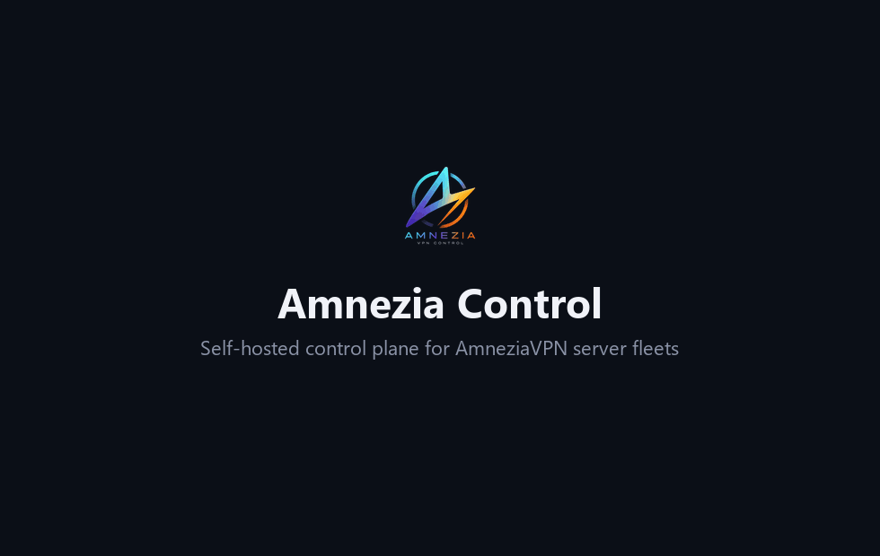

Nodes are managed over plain SSH (no agent installed on them). Three protocols are supported side by side: **AmneziaWG**, **OpenVPN over Cloak**, and **XRay / REALITY**. Clients are issued in the AmneziaVPN `vpn://` format (with a scannable animated QR) and, for WireGuard, as a plain `.conf`.

## Why Amnezia Control

The [AmneziaVPN desktop client](https://amnezia.org) is great for personal use — set up a server, connect, share access. Amnezia Control is for when you run **several nodes for a team** and doing it by hand stops scaling.

| Capability | Desktop AmneziaVPN | Amnezia Control |
|---|:---:|:---:|
| Manage a whole server fleet | Partial | ✅ |
| Import existing servers (`vpn://` or bulk) | ❌ | ✅ |
| Clients from a single interface | ❌ | ✅ |
| Auto-expiring access | ❌ | ✅ |
| Pause & resume a client (keep the slot) | ❌ | ✅ |
| Traffic & node-health monitoring | ❌ | ✅ |
| Telegram & webhook alerts | ❌ | ✅ |
| Config snapshots & one-click rollback | ❌ | ✅ |
| Scheduled backups & restore | ❌ | ✅ |
| Audit log & panel 2FA | ❌ | ✅ |

> Independent open-source project — not affiliated with or endorsed by [AmneziaVPN](https://github.com/amnezia-vpn/amnezia-client).

---

## Features

**Servers & nodes**
- Add servers with one-command onboarding (auto-setup over SSH password, or a copy-paste root script)
- Import already-deployed servers from an AmneziaVPN "full access" `vpn://` link or a bulk host list
- Deploy AmneziaWG / XRay / OpenVPN-over-Cloak to a clean server (build-on-target, config-preserving)
- Update the server core in one click; live deploy log
- Per-node resource monitoring: CPU load, RAM, disk, uptime — right on the card
- Organize servers into collapsible **groups** (folders) — by company, location, etc.

**Clients**
- Issue / revoke / reissue configs per protocol, with search, sorting and notes
- Animated QR in the exact AmneziaVPN format the app scans, plus plain `.conf` for WireGuard
- **Expiry**: set a lifetime per client (7 / 30 / 90 days or a custom date) — a background task auto-revokes on the node when it lapses
- **Per-client traffic history** (AmneziaWG & OpenVPN) with a speed chart and cumulative totals
- **Top clients by traffic** across all servers on the dashboard

**Monitoring & alerts**
- Overview dashboard: aggregate traffic and online-clients charts (24 h), per-server breakdown
- **Server-down alerts** and **low-disk alerts** to Telegram and/or a webhook, configured from the UI

**Operations & security**
- **Two-factor auth (TOTP)** for panel login
- Action **audit log** (who issued / revoked / deployed / deleted, and when)
- DB **backup & restore** (download an archive, or restore from one) + scheduled auto-backups with rotation
- **Dark / light theme** and **English / Russian** UI
- Edge TLS + IP allow-list via `caddy-docker-proxy` labels (or bring your own reverse proxy)

---

## Screenshots

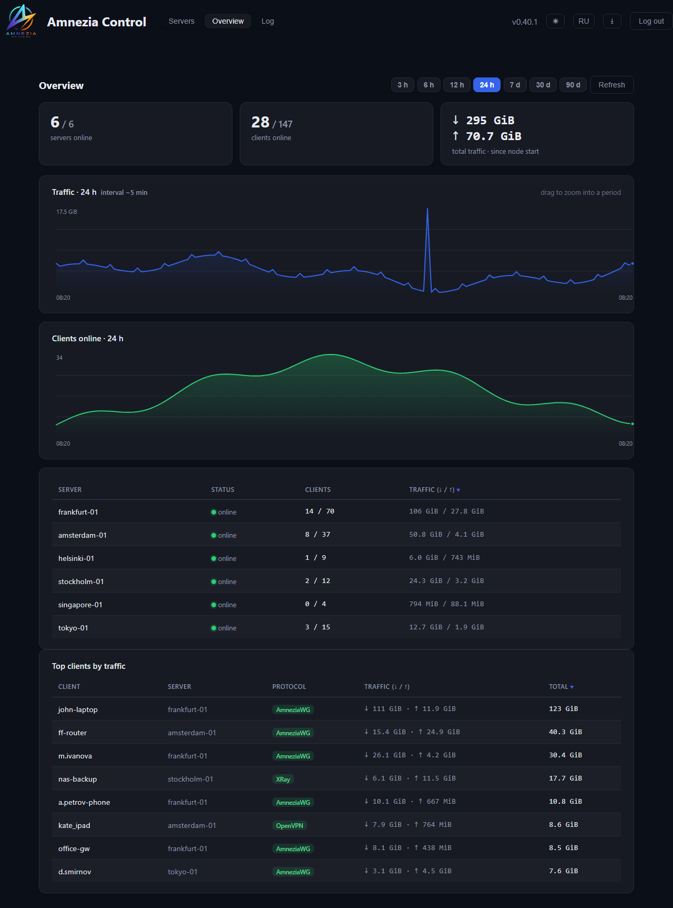

| Servers (dark) | Servers (light) |
|---|---|
| 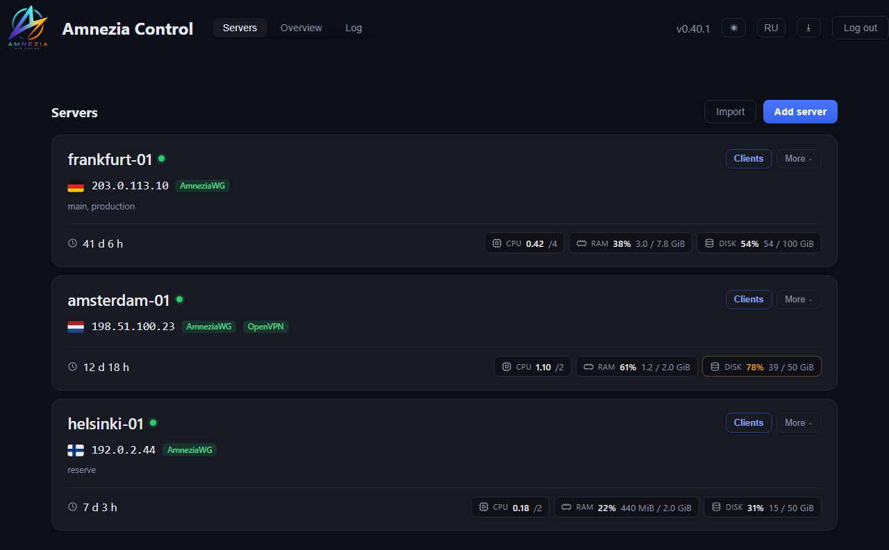 | 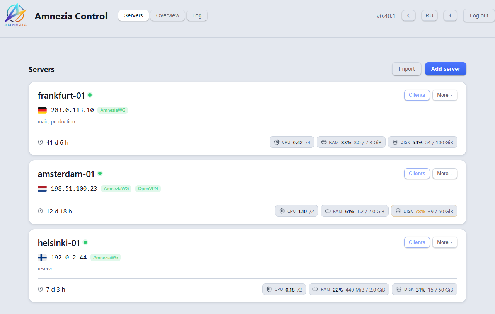 |

| Clients | Server-down alerts | Two-factor auth |
|---|---|---|
| 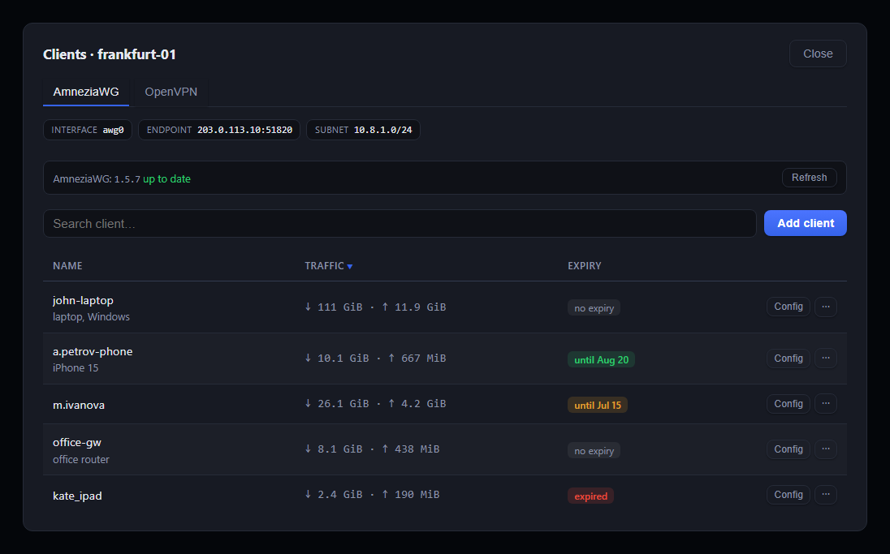 | 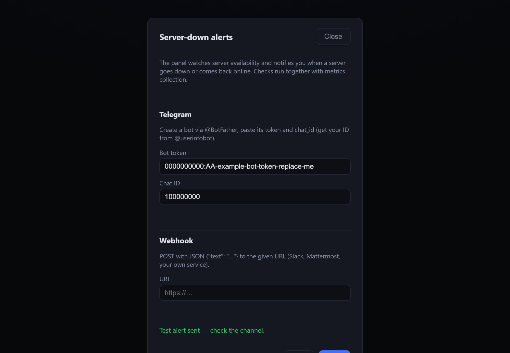 | 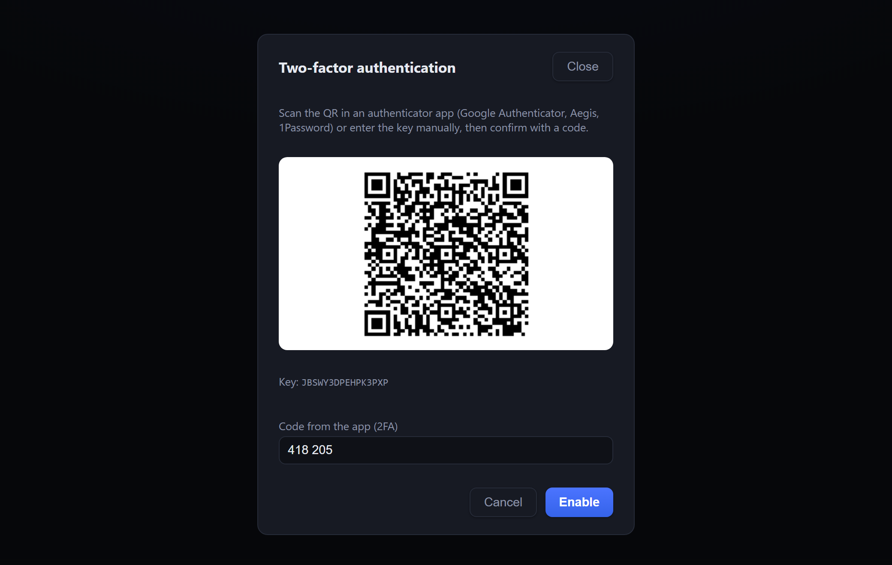 |

| Deploy a protocol | Action log | Import servers |
|---|---|---|
| 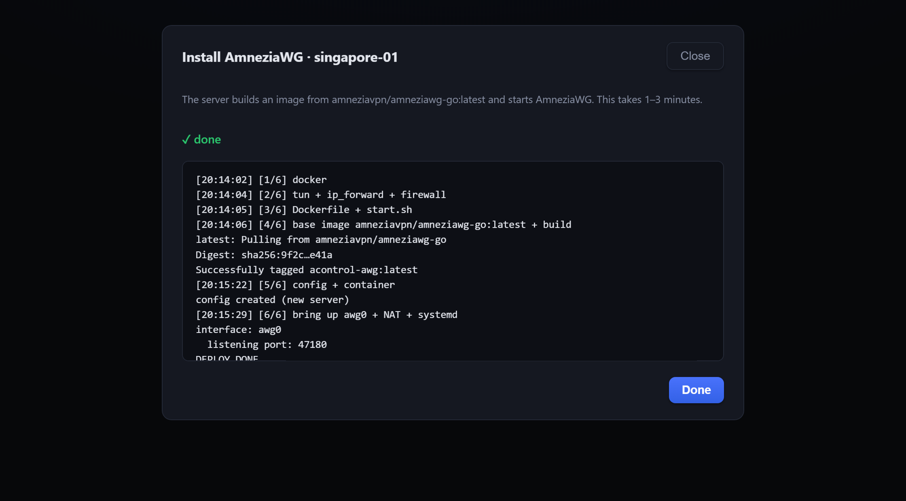 | 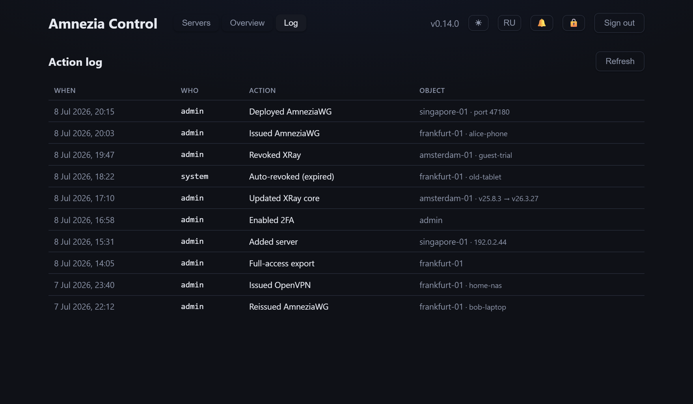 | 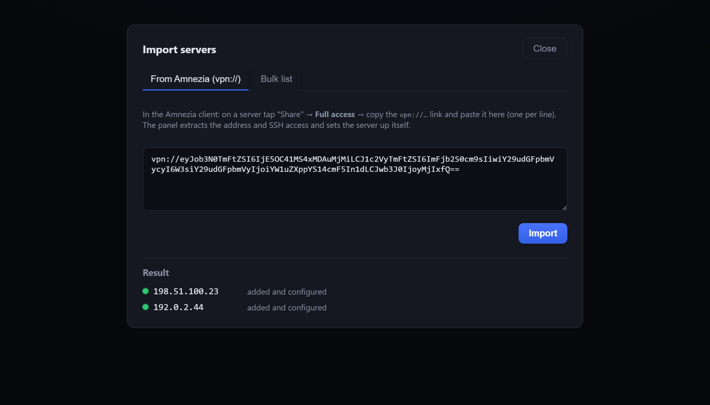 |

**Issuing a client config** — an animated QR in the exact format the AmneziaVPN app scans, plus a plain `.conf` for the AmneziaWG / WireGuard apps:

| AmneziaWG `.conf` | AmneziaVPN app (`vpn://`) |
|---|---|
| 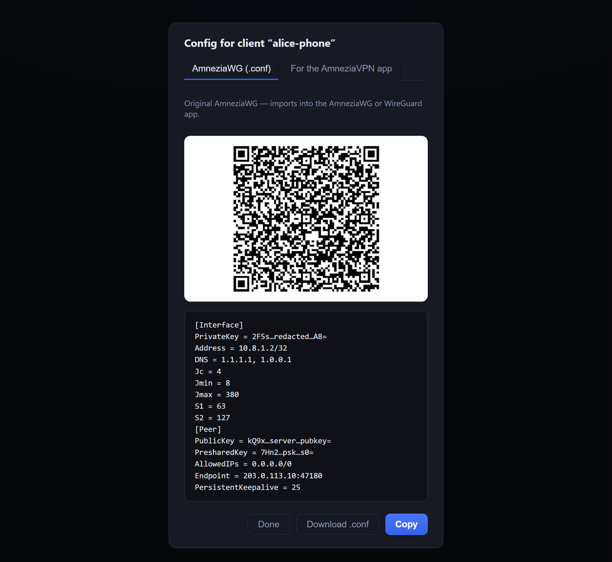 | 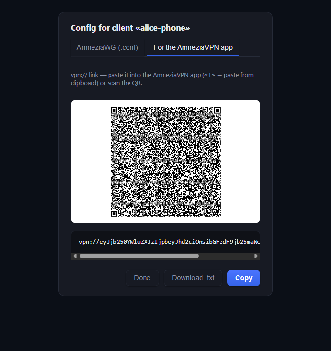 |

---

## Architecture

- **Backend** — Python 3.12, FastAPI, SQLAlchemy (async) + Alembic, node management over SSH via `asyncssh`
- **Database** — PostgreSQL 17 (SQLite in tests)
- **Frontend** — React + Vite + TypeScript, hand-rolled SVG charts, no UI framework
- **Delivery** — Docker Compose on a single host; the panel builds protocol images *on the target node* from the official `amneziavpn/*` base images, so only a tiny script travels over SSH

The panel holds its own SSH keypair and connects to each node as an unprivileged `acontrol` user (docker access via group or `sudo`). Client private keys for WireGuard/OpenVPN are generated **on the panel** — only the public key / CSR ever reaches a node.

---

## Requirements

- A Linux host for the panel with **Docker** and **Docker Compose** (v2)
- A reverse proxy for HTTPS (nginx / Caddy / Traefik) — an optional caddy-docker-proxy override is included
- VPN **nodes**: Linux with Docker; reachable over SSH from the panel

---

## Quick start

> **Requires** Docker Engine + the Compose plugin. On a fresh server: `curl -fsSL https://get.docker.com | sh`.

**Prebuilt images (fastest)** — multi-arch (amd64/arm64) images are published to GHCR on every release, so no local build:

```bash
git clone https://github.com/mihsergeev/amnezia-control.git acontrol && cd acontrol
cp .env.example .env
# edit .env — set ADMIN_PASSWORD, DB_PASSWORD, JWT_SECRET, PANEL_IP
docker compose pull && docker compose up -d
```

**Build from source** — same, but build the images yourself:

```bash
docker compose up -d --build
```

This is **standalone**: the panel is published on the host at `ACONTROL_BIND` (default `127.0.0.1:8080`). Open it at http://127.0.0.1:8080, or set `ACONTROL_BIND=0.0.0.0:8080` to expose it on all interfaces. Generate the JWT secret with `openssl rand -hex 32`. Pin a version with `ACONTROL_VERSION=` in `.env` (default `latest`).

### HTTPS / reverse proxy

The panel serves plain HTTP — **put a reverse proxy with TLS in front**. It's a login-protected control panel, so don't expose it over plain HTTP on the internet.

**HTTPS in one step (recommended) — bundled Caddy + a free [sslip.io](https://sslip.io) domain.** No domain of your own needed: sslip.io turns your server's IP into a hostname (dashes for dots — `203.0.113.10` → `203-0-113-10.sslip.io`), and a bundled Caddy fetches a real Let's Encrypt certificate for it automatically.

```bash
# in .env — use YOUR server's public IP with dashes:
#   ACONTROL_DOMAIN=203-0-113-10.sslip.io
#   ACONTROL_ALLOW_IPS=          # empty = open to everyone (login + 2FA guard it)
docker compose -f compose.yml -f compose.tls.yml up -d
```

Open `https://<your-ip-dashed>.sslip.io`. Ports **80 and 443 must be reachable** (Let's Encrypt validates over them). To **lock it to specific IPs** (everyone else gets 403), set an allow-list — no whitelist needed to just get going:

```bash
# in .env:
ACONTROL_ALLOW_IPS=203.0.113.10 198.51.100.0/24
```

(or put `COMPOSE_FILE=compose.yml:compose.tls.yml` in `.env` and just run `docker compose up -d`).

**Advanced — existing caddy-docker-proxy.** If you already run [caddy-docker-proxy](https://github.com/lucaslorentz/caddy-docker-proxy) — the *label-reading* proxy — an override joins its network and configures TLS + an IP allow-list via labels:

```bash
# in .env: set ACONTROL_DOMAIN, ACONTROL_ALLOW_IPS, and
# ACONTROL_CADDY_NETWORK (the network your caddy-docker-proxy watches), then:
docker compose -f compose.yml -f compose.caddy.yml up -d --build
```

(or put `COMPOSE_FILE=compose.yml:compose.caddy.yml` in `.env`). The panel's frontend must share the **same Docker network** as caddy-docker-proxy — set `ACONTROL_CADDY_NETWORK` if it isn't named `caddy`. Leave `ACONTROL_ALLOW_IPS` empty to allow from any IP (rely on the login + 2FA).

**Any other proxy** (plain Caddy with a Caddyfile, nginx, Traefik) doesn't read these labels — use standalone mode instead: publish the port (`ACONTROL_BIND`) and point your proxy at it, or attach your proxy to the `acontrol_internal` network and proxy to `acontrol-frontend-1:80`.

---

## Adding a VPN node

Add the server in the panel (name, host, SSH port, SSH user) and pick a setup method:

1. **With a script** (recommended for a fresh node) — save, then run the shown script as **root** on the node (SSH in and paste it). It **creates the SSH user**, installs the panel's key and opens the firewall for the panel IP. Nothing to prepare by hand. Then click **Check** on the card. Also works when a firewall blocks inbound SSH from the panel, since the script opens access itself.
2. **Auto-setup by SSH password** — the panel connects once with the given user's password, installs its key and opens the SSH port **for the panel IP only** (password not stored). The user must already exist with a password, and the node needs `PasswordAuthentication yes`.

You can also **import** existing AmneziaVPN servers via their "full access" `vpn://` link, or add many at once from a `host:port user password` list.

> Firewall: the panel only opens the **SSH port for its own IP** (via ufw / firewalld / `hosts.allow`). The **VPN port** is opened to the world by the deploy step (Docker publish + ufw / firewalld), because clients need it — nothing else is exposed.

---

## Configuration

Set in `.env` (see [`.env.example`](.env.example)):

| Variable | Default | Meaning |
|---|---|---|
| `ACONTROL_ADMIN_USER` / `ACONTROL_ADMIN_PASSWORD` | `admin` / — | Panel login |
| `ACONTROL_DB_PASSWORD` | — | PostgreSQL password (internal) |
| `ACONTROL_JWT_SECRET` | — | JWT signing secret (32+ random bytes) |
| `ACONTROL_PANEL_IP` | — | Public IP of the panel (written into node firewall rules) |
| `ACONTROL_DEFAULT_SSH_USER` | `acontrol` | Prefilled SSH user for new servers |
| `ACONTROL_STATS_INTERVAL` | `300` | Metrics/monitoring interval, seconds (0 = off) |
| `ACONTROL_EXPIRY_INTERVAL` | `300` | Expired-client auto-revoke scan, seconds (0 = off) |
| `ACONTROL_DISK_ALERT_PERCENT` | `90` | Low-disk alert threshold, % (0 = off) |
| `ACONTROL_BACKUP_INTERVAL_HOURS` | `24` | Auto-backup interval (0 = off) |
| `ACONTROL_BACKUP_KEEP` | `14` | Auto-backups to keep |

Telegram / webhook alert channels are configured **from the UI** (🔔 button) and stored in the DB.

---

## Integration API

Other systems (a billing panel, your own portal) can manage AmneziaWG clients over
a versioned HTTP API at `/api/v1`. Interactive docs: **`/api/docs`**.

Create a key in the panel under **API keys**. It is shown once — store it right
away, only a hash is kept. Send it in the `X-API-Key` header:

```bash
curl -H "X-API-Key: ack_..." https://panel.example.com/api/v1/servers

# issue a client -> returns the .conf text and a vpn:// link
curl -X POST -H "X-API-Key: ack_..." -H "Content-Type: application/json"   -d '{"name": "alice"}'   https://panel.example.com/api/v1/servers/1/clients

# revoke (public key is base64 -> url-encode it)
curl -X DELETE -H "X-API-Key: ack_..."   "https://panel.example.com/api/v1/servers/1/clients?public_key=abc%2Fdef%3D"
```

A key's permissions are deliberately narrow: it may list servers and issue,
fetch, revoke, pause and resume clients — it **cannot** deploy or delete servers,
change settings, export full access, or create further keys. Revoke a key at any
time from the same page; everything it did is in the audit log as `apikey:<name>`.

## Security notes

- Set a strong `ACONTROL_JWT_SECRET` (`openssl rand -hex 32`) and admin password — **the panel refuses to start** on empty/default values.
- Change the admin password from the UI (🔑); it invalidates all existing sessions. Enable **2FA** (🔒).
- The panel **pins each node's SSH host key** on first connect (TOFU) and verifies it after. If you rebuild a node, delete its line from `data/ssh/known_hosts` so the new key can be pinned.
- Keep the edge **IP allow-list** tight (Caddy labels) — an **empty** `ACONTROL_ALLOW_IPS` means "allow all", leaving only the login in front.
- Put **HTTPS** in front (Caddy edge or your own proxy) — the full-access link and QR configs are secrets in transit.
- The **"Full access" export** produces a `vpn://` link containing a private SSH key that is root-equivalent on the node — treat it like a secret. It uses a dedicated key; regenerating invalidates the old one.
- DB backups (`db.json`) contain secrets (password hash, client private keys, panel SSH key) — store them safely; the auto-backups dir is `0700`.
- **Security events** — brute-force lockout, a node's host key changing (possible MITM), and password change are written to the **audit log** and sent to your **Telegram/webhook alerts** (🔔) if configured. Watch for them.
- **Lost the password *and* 2FA?** Set `ACONTROL_ADMIN_PASSWORD_RESET=1` (with a new `ACONTROL_ADMIN_PASSWORD`), restart once to reset the password and disable 2FA, then set it back to `0` and restart.

---

## Backups

- **Backup → Download** grabs a `tar.gz` with a JSON dump of all tables plus the panel's SSH key.
- **Backup → Restore from file** replaces the current state from such an archive.
- Scheduled auto-backups are written to `./data/backups` with rotation; browse and download them from **Backup → Auto-backups**.

---

## Updating

The panel is a normal git checkout — pull and rebuild:

```bash
cd acontrol
git pull
docker compose up -d --build
```

Database migrations run automatically on backend startup. If you use the caddy override, keep `COMPOSE_FILE` in `.env` (or add `-f compose.yml -f compose.caddy.yml`). Grab a DB backup first (**Backup → Download**) as a restore point.

## Development

```bash
# backend
cd backend
python -m venv .venv
.venv/bin/pip install -e ".[dev]"
.venv/bin/python -m uvicorn app.main:app --reload   # http://localhost:8000/api/docs
.venv/bin/python -m pytest

# frontend (proxies /api to :8000)
cd frontend
npm install
npm run dev                                          # http://localhost:5173
```

DB migrations (Alembic) run automatically on backend startup.

---

## Contributing

Issues and pull requests are welcome.

1. Fork, create a branch.
2. Backend: `cd backend && pytest` must pass; keep it typed and minimal.
3. Frontend: `cd frontend && npm run build` must pass (`tsc` + `vite`).
4. Keep the UI bilingual — add both the Russian source string and its English translation in `frontend/src/i18n.tsx`.

For larger changes, open an issue first to discuss the direction.

## License

**GNU AGPL-3.0** — see [`LICENSE`](LICENSE). You may self-host and modify it freely; if you run a modified version as a network service, you must make your source available to its users (AGPL §13).
