<p align="center">
  
</p>

<p align="center">
  <b>Собственная веб-панель для управления парком VPN-серверов</b> — разворачивайте ноды, выдавайте и отзывайте клиентские конфиги, следите за трафиком и здоровьем серверов из одного места. Замена ручному управлению серверами через десктоп-клиент AmneziaVPN.
</p>

<p align="center"><a href="README.md">English</a> · <b>Русский</b></p>

<p align="center">
  
  
  
  
  
</p>

<p align="center"><a href="CHANGELOG.md">Список изменений</a> · <a href="https://github.com/mihsergeev/amnezia-control/releases">Релизы</a></p>

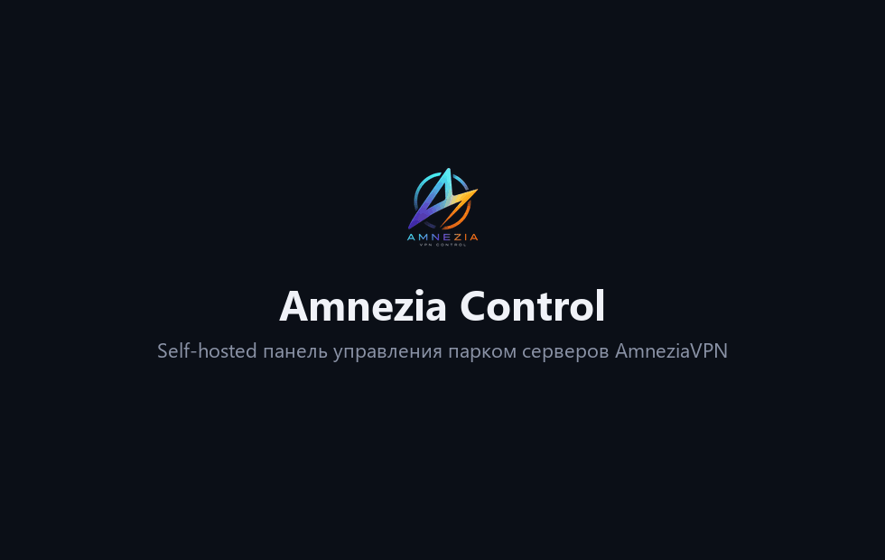

Ноды управляются по обычному SSH (агент на них не ставится). Поддерживаются три протокола сразу: **AmneziaWG**, **OpenVPN поверх Cloak** и **XRay / REALITY**. Клиенты выдаются в формате AmneziaVPN `vpn://` (со сканируемым анимированным QR), а для WireGuard — ещё и обычным `.conf`.

## Почему Amnezia Control

Настольный клиент [AmneziaVPN](https://amnezia.org) хорош для личного использования — поднять сервер, подключиться, поделиться доступом. Amnezia Control — для случая, когда у вас **несколько нод на команду** и управлять ими вручную перестаёт масштабироваться.

| Возможность | Desktop AmneziaVPN | Amnezia Control |
|---|:---:|:---:|
| Управление целым парком серверов | Частично | ✅ |
| Импорт существующих серверов (`vpn://` или списком) | ❌ | ✅ |
| Клиенты из одного интерфейса | ❌ | ✅ |
| Автоматическое истечение доступа | ❌ | ✅ |
| Пауза и возобновление клиента (без пересоздания) | ❌ | ✅ |
| Мониторинг трафика и состояния нод | ❌ | ✅ |
| Telegram- и webhook-алерты | ❌ | ✅ |
| Снимки конфига и откат в один клик | ❌ | ✅ |
| Бэкапы по расписанию + восстановление | ❌ | ✅ |
| Audit log и 2FA панели | ❌ | ✅ |

> Независимый open-source-проект, не связан с [AmneziaVPN](https://github.com/amnezia-vpn/amnezia-client) и не является официальным продуктом.

---

## Возможности

**Серверы и ноды**
- Добавление серверов с онбордингом в одно действие (автонастройка по SSH-паролю или скрипт для запуска под root)
- Импорт уже развёрнутых серверов из ссылки AmneziaVPN «Полный доступ» (`vpn://`) или списком хостов
- Разворачивание AmneziaWG / XRay / OpenVPN-over-Cloak на чистый сервер (сборка на самой ноде, с сохранением клиентов)
- Обновление серверного ядра в один клик; живой лог деплоя
- Мониторинг ресурсов ноды: загрузка CPU, RAM, диск, аптайм — прямо на карточке
- Группировка серверов в сворачиваемые **папки** — по компании, локации и т.п.

**Клиенты**
- Выдача / отзыв / перевыпуск конфигов по протоколам, с поиском, сортировкой и заметками
- Анимированный QR в том самом формате AmneziaVPN, который приложение реально сканирует, плюс обычный `.conf` для WireGuard
- **Срок действия**: задайте клиенту срок (7 / 30 / 90 дней или своя дата) — фоновая задача сама отзывает его на ноде по истечении
- **История трафика по клиенту** (AmneziaWG и OpenVPN) — график скорости и накопленный объём
- **Топ клиентов по трафику** по всем серверам на дашборде

**Мониторинг и алерты**
- Дашборд «Обзор»: сводные графики трафика и онлайн-клиентов (24 ч), разбивка по серверам
- **Алерты о падении сервера** и **о нехватке места на диске** в Telegram и/или на вебхук, настройка из UI

**Эксплуатация и безопасность**
- **Двухфакторная аутентификация (TOTP)** на вход в панель
- **Журнал действий** (кто и когда выдал / отозвал / развернул / удалил)
- **Бэкап и восстановление** БД (скачать архив или восстановить из него) + авто-бэкапы по расписанию с ротацией
- **Тёмная / светлая тема** и **русский / английский** интерфейс
- TLS и IP-whitelist на входе через метки `caddy-docker-proxy` (или свой реверс-прокси)

---

## Скриншоты

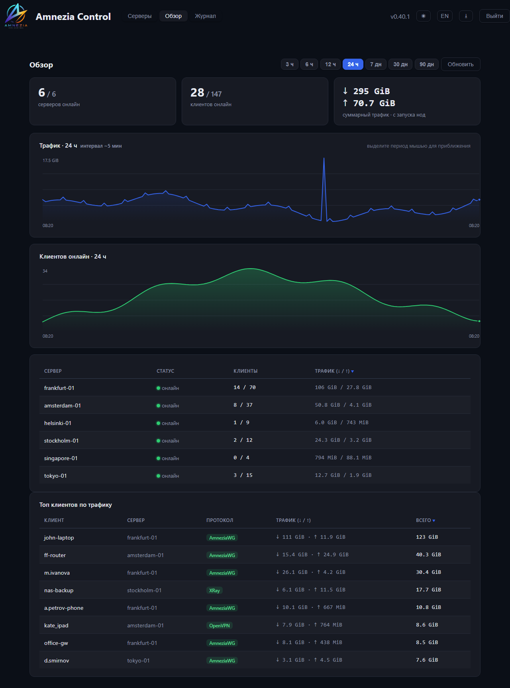

| Серверы (тёмная) | Серверы (светлая) |
|---|---|
| 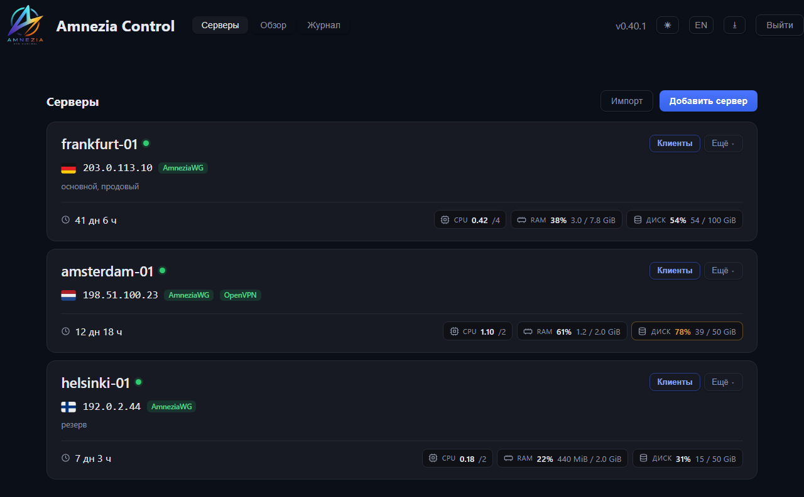 | 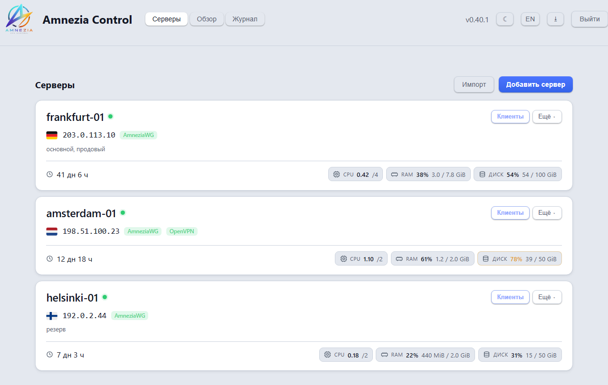 |

| Клиенты | Алерты о падении | Двухфакторная аутентификация |
|---|---|---|
| 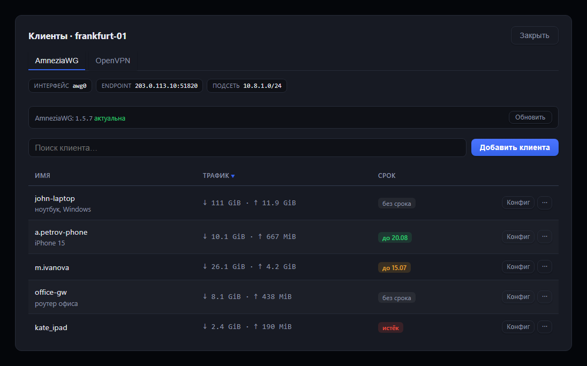 | 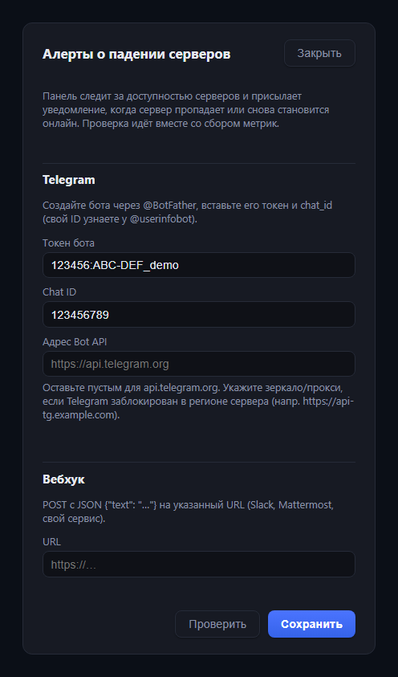 | 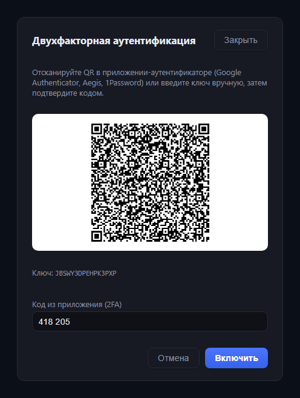 |

| Разворачивание протокола | Журнал действий | Импорт серверов |
|---|---|---|
| 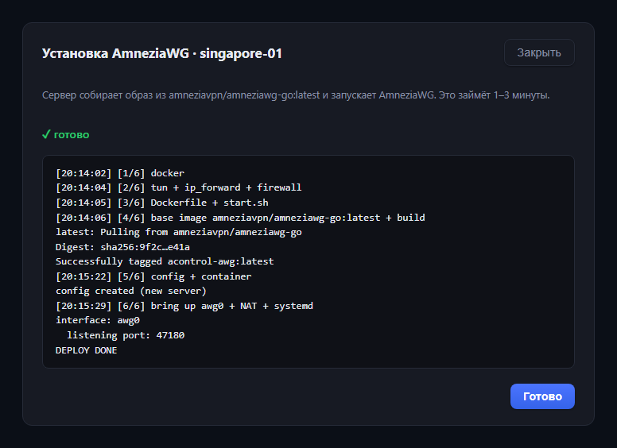 | 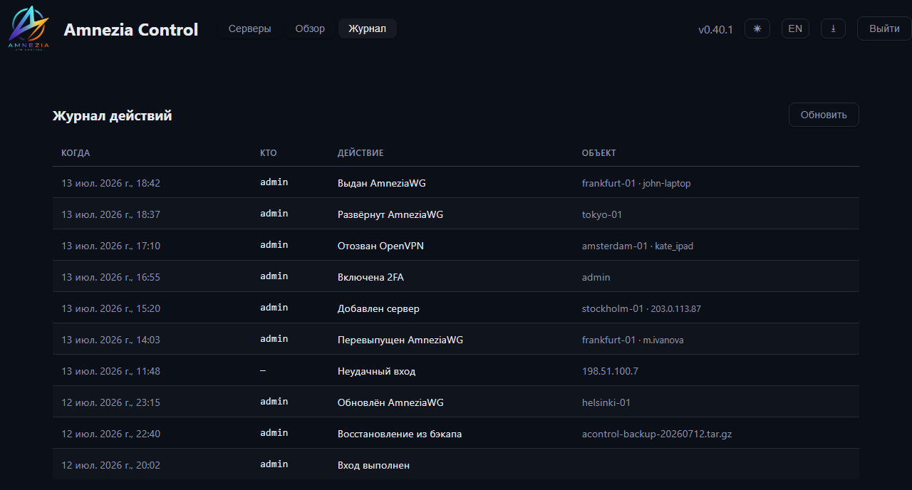 | 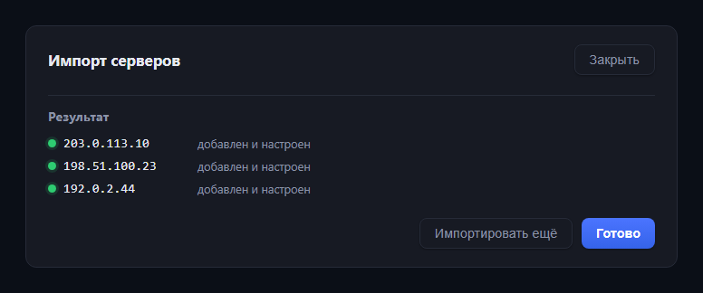 |

**Выдача клиентского конфига** — анимированный QR ровно в том формате, который сканирует приложение AmneziaVPN, плюс обычный `.conf` для приложений AmneziaWG / WireGuard:

| AmneziaWG `.conf` | Приложение AmneziaVPN (`vpn://`) |
|---|---|
| 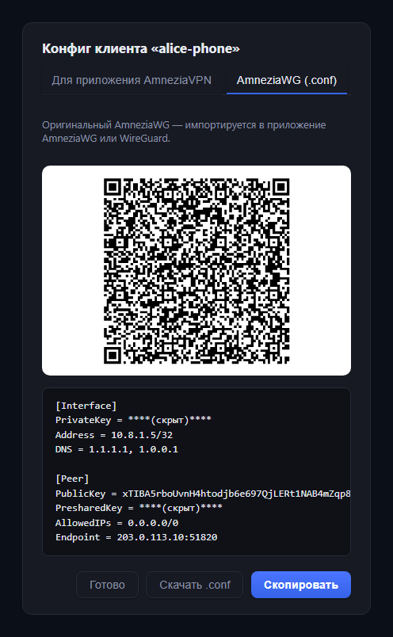 | 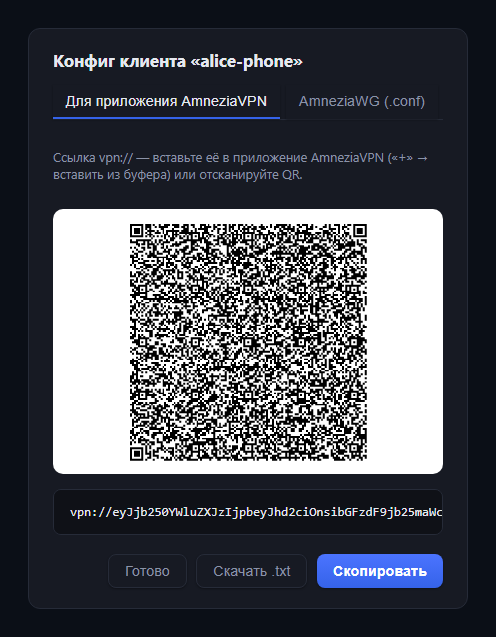 |

---

## Архитектура

- **Бэкенд** — Python 3.12, FastAPI, SQLAlchemy (async) + Alembic, управление нодами по SSH через `asyncssh`
- **БД** — PostgreSQL 17 (в тестах — SQLite)
- **Фронтенд** — React + Vite + TypeScript, SVG-графики без сторонних либ, без UI-фреймворка
- **Доставка** — Docker Compose на одном хосте; образы протоколов панель собирает *на самой ноде* из официальных базовых образов `amneziavpn/*` — по SSH уходит только крошечный скрипт

У панели свой SSH-ключ; к каждой ноде она подключается непривилегированным пользователем `acontrol` (доступ к docker через группу или `sudo`). Приватные ключи клиентов WireGuard/OpenVPN генерируются **на панели** — на ноду уходит только публичный ключ / CSR.

---

## Требования

- Linux-хост под панель с **Docker** и **Docker Compose** (v2)
- Реверс-прокси для HTTPS (nginx / Caddy / Traefik) — опциональный override под caddy-docker-proxy в комплекте
- VPN-**ноды**: Linux с Docker, доступные по SSH с панели

---

## Быстрый старт

> **Нужен** Docker Engine + плагин Compose. На чистом сервере: `curl -fsSL https://get.docker.com | sh`.

**Готовые образы (быстрее всего)** — multi-arch (amd64/arm64) образы публикуются в GHCR на каждый релиз, локальная сборка не нужна:

```bash
git clone https://github.com/mihsergeev/amnezia-control.git acontrol && cd acontrol
cp .env.example .env
# отредактируйте .env — задайте ADMIN_PASSWORD, DB_PASSWORD, JWT_SECRET, PANEL_IP
docker compose pull && docker compose up -d
```

**Сборка из исходников** — то же самое, но образы собираются локально:

```bash
docker compose up -d --build
```

Это **самодостаточный** режим: панель публикуется на хосте по адресу `ACONTROL_BIND` (по умолчанию `127.0.0.1:8080`). Откройте http://127.0.0.1:8080 или задайте `ACONTROL_BIND=0.0.0.0:8080`, чтобы открыть на всех интерфейсах. JWT-секрет удобно сгенерировать через `openssl rand -hex 32`. Закрепить версию можно через `ACONTROL_VERSION=` в `.env` (по умолчанию `latest`).

### HTTPS / реверс-прокси

Панель отдаёт обычный HTTP — **поставьте перед ней реверс-прокси с TLS**. Это админ-панель под логином, не выставляйте её в интернет по голому HTTP.

**HTTPS в один шаг (рекомендуется) — встроенный Caddy + бесплатный домен [sslip.io](https://sslip.io).** Свой домен не нужен: sslip.io превращает IP сервера в имя хоста (точки → дефисы: `203.0.113.10` → `203-0-113-10.sslip.io`), а встроенный Caddy сам получает для него настоящий сертификат Let's Encrypt.

```bash
# в .env — подставьте ПУБЛИЧНЫЙ IP своего сервера через дефисы:
#   ACONTROL_DOMAIN=203-0-113-10.sslip.io
#   ACONTROL_ALLOW_IPS=          # пусто = открыто всем (защита на логине + 2FA)
docker compose -f compose.yml -f compose.tls.yml up -d
```

Откройте `https://<ip-через-дефисы>.sslip.io`. **Порты 80 и 443 должны быть доступны** (по ним валидируется Let's Encrypt). Чтобы **ограничить доступ по IP** (остальным — 403), задайте вайтлист — но для «просто поднять» он не нужен:

```bash
# в .env:
ACONTROL_ALLOW_IPS=203.0.113.10 198.51.100.0/24
```

(либо впишите `COMPOSE_FILE=compose.yml:compose.tls.yml` в `.env` и запускайте просто `docker compose up -d`).

**Продвинуто — уже развёрнутый caddy-docker-proxy.** Если у вас именно [caddy-docker-proxy](https://github.com/lucaslorentz/caddy-docker-proxy) (прокси, читающий docker-**метки**), override подключается к его сети и настраивает TLS + IP-whitelist через метки:

```bash
# в .env: задайте ACONTROL_DOMAIN, ACONTROL_ALLOW_IPS и
# ACONTROL_CADDY_NETWORK (сеть, за которой следит ваш caddy-docker-proxy), затем:
docker compose -f compose.yml -f compose.caddy.yml up -d --build
```

(либо впишите `COMPOSE_FILE=compose.yml:compose.caddy.yml` в `.env`). Фронтенд панели должен быть в **той же docker-сети**, что и caddy-docker-proxy — задайте `ACONTROL_CADDY_NETWORK`, если она называется не `caddy`. Оставьте `ACONTROL_ALLOW_IPS` пустым — доступ будет со всех IP (защита остаётся на логине + 2FA).

**Любой другой прокси** (обычный Caddy с Caddyfile, nginx, Traefik) эти метки не читает — используйте standalone: опубликуйте порт (`ACONTROL_BIND`) и направьте прокси на него, либо подключите свой прокси к сети `acontrol_internal` и проксируйте на `acontrol-frontend-1:80`.

---

## Добавление VPN-ноды

Добавьте сервер в панели (имя, хост, SSH-порт, SSH-пользователь) и выберите способ настройки:

1. **Скриптом** (рекомендуется для чистой ноды) — сохраните, затем зайдите на ноду по SSH под **root** и вставьте показанный скрипт. Он **сам создаёт SSH-пользователя**, ставит ключ панели и открывает фаервол для IP панели. Вручную готовить ничего не надо. Потом нажмите **«Проверить»** на карточке. Подходит и когда фаервол блокирует входящий SSH с панели — скрипт сам открывает доступ.
2. **Автонастройка по SSH-паролю** — панель один раз заходит по паролю указанного пользователя, ставит свой ключ и открывает SSH-порт **только для IP панели** (пароль не сохраняется). Пользователь должен уже существовать и иметь пароль, а на ноде нужен `PasswordAuthentication yes`.

Также можно **импортировать** существующие серверы AmneziaVPN по ссылке «Полный доступ» (`vpn://`) или добавить пачкой списком `host:port user password`.

> Фаервол: панель открывает **только SSH-порт и только для своего IP** (через ufw / firewalld / `hosts.allow`). **VPN-порт** открывает наружу шаг деплоя (Docker publish + ufw / firewalld) — он нужен клиентам; больше ничего не открывается.

---

## Конфигурация

Задаётся в `.env` (см. [`.env.example`](.env.example)):

| Переменная | По умолчанию | Значение |
|---|---|---|
| `ACONTROL_ADMIN_USER` / `ACONTROL_ADMIN_PASSWORD` | `admin` / — | Вход в панель |
| `ACONTROL_DB_PASSWORD` | — | Пароль PostgreSQL (внутренний) |
| `ACONTROL_JWT_SECRET` | — | Секрет подписи JWT (32+ случайных байта) |
| `ACONTROL_PANEL_IP` | — | Публичный IP панели (вписывается в правила фаервола нод) |
| `ACONTROL_DEFAULT_SSH_USER` | `acontrol` | SSH-пользователь по умолчанию для новых серверов |
| `ACONTROL_STATS_INTERVAL` | `300` | Интервал сбора метрик/мониторинга, сек (0 = выкл) |
| `ACONTROL_EXPIRY_INTERVAL` | `300` | Скан авто-отзыва истёкших клиентов, сек (0 = выкл) |
| `ACONTROL_DISK_ALERT_PERCENT` | `90` | Порог алерта о нехватке места, % (0 = выкл) |
| `ACONTROL_BACKUP_INTERVAL_HOURS` | `24` | Интервал авто-бэкапа (0 = выкл) |
| `ACONTROL_BACKUP_KEEP` | `14` | Сколько авто-бэкапов хранить |

Каналы алертов (Telegram / вебхук) настраиваются **из UI** (кнопка 🔔) и хранятся в БД.

---

## Интеграционный API

Внешние системы (биллинг, свой портал) могут управлять клиентами AmneziaWG через
версионированный HTTP API `/api/v1`. Интерактивная документация: **`/api/docs`**.

Ключ создаётся в панели в разделе **API-ключи**. Он показывается один раз —
сохраните сразу, в базе лежит только хэш. Передаётся в заголовке `X-API-Key`:

```bash
curl -H "X-API-Key: ack_..." https://panel.example.com/api/v1/servers

# выдать клиента -> вернёт текст .conf и ссылку vpn://
curl -X POST -H "X-API-Key: ack_..." -H "Content-Type: application/json"   -d '{"name": "alice"}'   https://panel.example.com/api/v1/servers/1/clients

# отозвать (public key — base64, его нужно url-кодировать)
curl -X DELETE -H "X-API-Key: ack_..."   "https://panel.example.com/api/v1/servers/1/clients?public_key=abc%2Fdef%3D"
```

Права ключа намеренно узкие: список серверов и операции с клиентами (выдать,
забрать конфиг, отозвать, пауза/возобновление). Развернуть или удалить сервер,
сменить настройки, забрать полный доступ или выпустить новые ключи им **нельзя**.
Ключ отзывается в один клик там же; все его действия видны в журнале как
`apikey:<имя>`.

## Безопасность

- Задайте надёжные `ACONTROL_JWT_SECRET` (`openssl rand -hex 32`) и пароль админа — **на дефолтных/пустых панель не запустится**.
- Меняйте пароль админа из UI (🔑) — это завершает все прежние сессии. Включите **2FA** (🔒).
- Панель **запоминает host-ключ каждой ноды** при первом подключении (TOFU) и дальше сверяет его. После пересоздания ноды удалите её строку из `data/ssh/known_hosts`, чтобы записался новый ключ.
- Держите **IP-whitelist** на входе узким (метки Caddy) — **пустой** `ACONTROL_ALLOW_IPS` означает «со всех IP», оставляя только вход.
- Ставьте впереди **HTTPS** (Caddy или свой прокси) — ссылка полного доступа и QR-конфиги передаются как секреты.
- Экспорт **«Полный доступ»** отдаёт `vpn://` с приватным SSH-ключом, эквивалентным root на ноде — относитесь как к секрету. Ключ отдельный; при повторной генерации прежний перестаёт работать.
- Бэкапы БД (`db.json`) содержат секреты (хэш пароля, приватные ключи клиентов, SSH-ключ панели) — храните надёжно; каталог авто-бэкапов — `0700`.
- **События безопасности** — блокировка при брутфорсе, смена host-ключа ноды (возможный MITM), смена пароля — пишутся в **журнал** и уходят в **алерты Telegram/вебхук** (🔔), если настроены. Следите за ними.
- **Потеряли пароль И 2FA?** Поставьте `ACONTROL_ADMIN_PASSWORD_RESET=1` (и новый `ACONTROL_ADMIN_PASSWORD`), перезапустите один раз — пароль сбросится, 2FA отключится; затем верните `0` и перезапустите.

---

## Бэкапы

- **Бэкап → Скачать** отдаёт `tar.gz` с JSON-дампом всех таблиц и SSH-ключом панели.
- **Бэкап → Восстановить из файла** заменяет текущее состояние данными из такого архива.
- Авто-бэкапы по расписанию пишутся в `./data/backups` с ротацией; список и скачивание — в **Бэкап → Авто-бэкапы**.

---

## Обновление

Панель — обычный git-checkout: обновите и пересоберите:

```bash
cd acontrol
git pull
docker compose up -d --build
```

Миграции БД накатываются автоматически при старте бэкенда. Если используете caddy-override — держите `COMPOSE_FILE` в `.env` (или добавьте `-f compose.yml -f compose.caddy.yml`). Перед обновлением снимите бэкап БД (**Бэкап → Скачать**) как точку отката.

## Разработка

```bash
# бэкенд
cd backend
python -m venv .venv
.venv/bin/pip install -e ".[dev]"
.venv/bin/python -m uvicorn app.main:app --reload   # http://localhost:8000/api/docs
.venv/bin/python -m pytest

# фронтенд (проксирует /api на :8000)
cd frontend
npm install
npm run dev                                          # http://localhost:5173
```

Миграции БД (Alembic) накатываются автоматически при старте бэкенда.

---

## Вклад

Issues и pull request'ы приветствуются.

1. Форк, отдельная ветка.
2. Бэкенд: `cd backend && pytest` должен проходить; типизированно и лаконично.
3. Фронтенд: `cd frontend && npm run build` должен проходить (`tsc` + `vite`).
4. Держите интерфейс двуязычным — добавляйте и русскую исходную строку, и её английский перевод в `frontend/src/i18n.tsx`.

Для крупных изменений сначала откройте issue, чтобы обсудить направление.

## Лицензия

**GNU AGPL-3.0** — см. [`LICENSE`](LICENSE). Можно свободно поднимать у себя и дорабатывать; если поднимаете изменённую версию как сетевой сервис — обязаны открыть исходный код её пользователям (AGPL §13).
